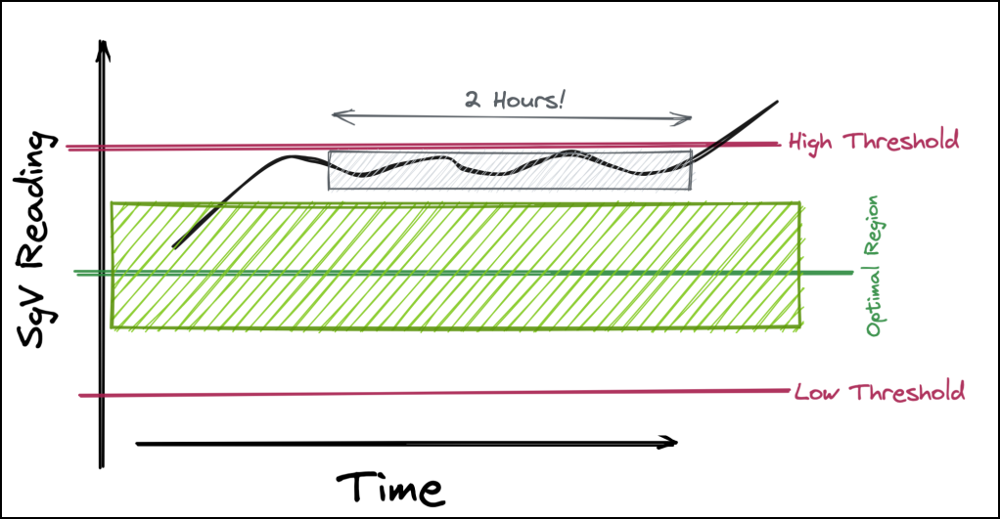
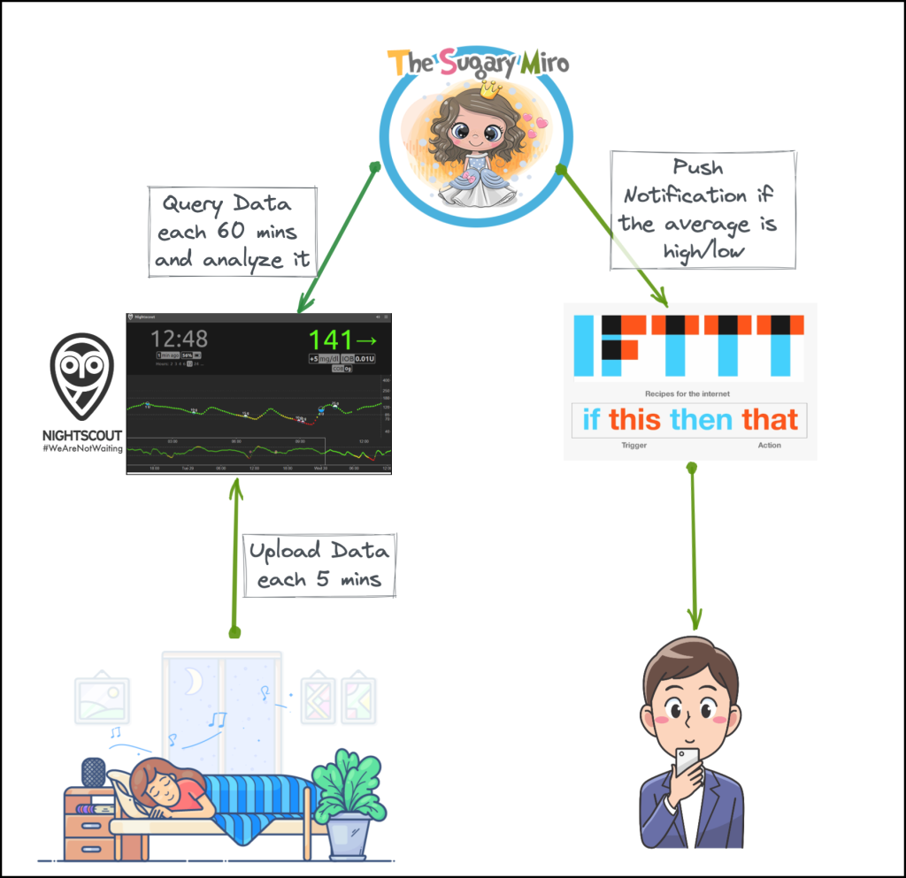
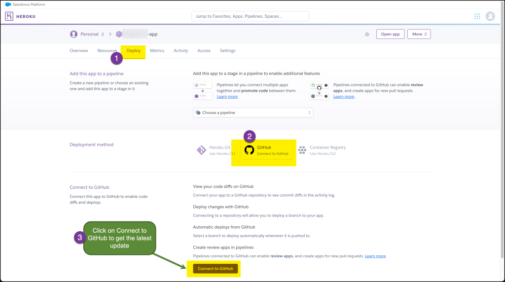
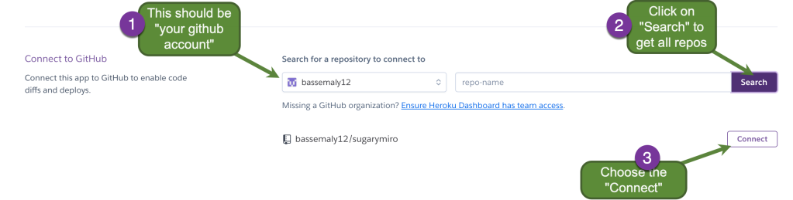
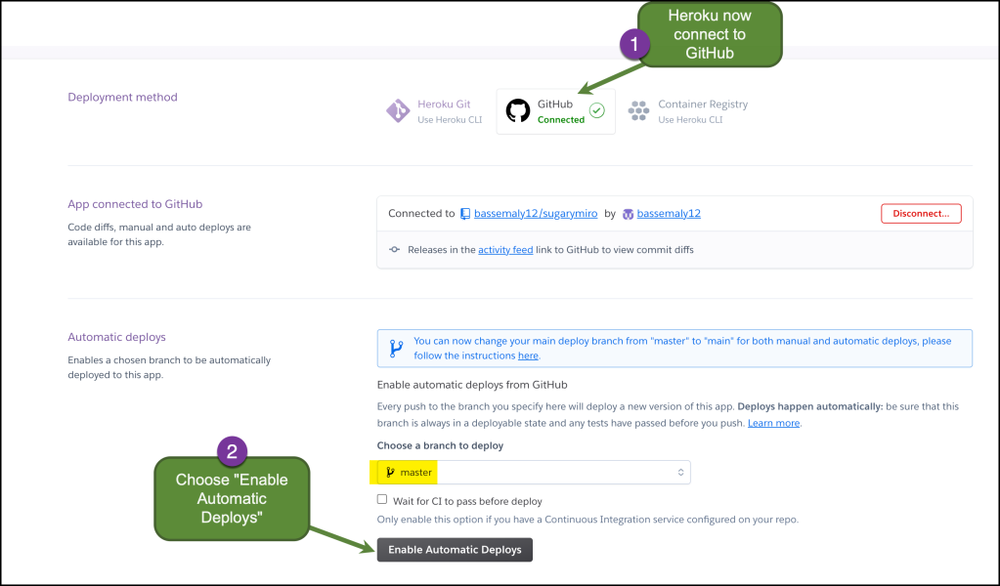
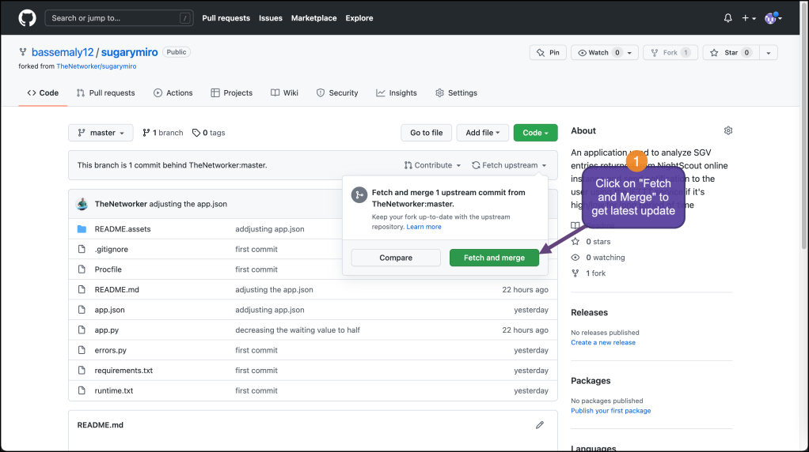
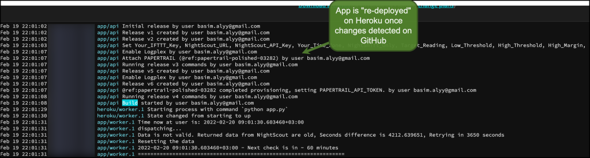

# The SugaryMiro App

# Introduction

This is an application used to analyze SGV entries returned from the NightScout online instance and send a notification to the user using the IFTTT service if it's high/low for a long period of time. This allows you to get **actionable insights** on Glucose patterns throughout the day

# How does it work?

The application will query the NightScout API endpoint and retrieve data of the last hour then analyze them. if the app found the average is higher/lower than user-configured values (+ margin) and, at the same time, the last SgV direction won’t correct that (i.e. the average SgV is high and the last entry direction is “**Flat**” or not in “**Hypoglycemia**“) then it will immediately send a notification to the user using the IFTTT service. In that case, I don’t need to check the NightScout dashboard regularly to find the pattern or worry about the high/low entries. The SugaryMiro app will analyze the data and send me to take an action!

# Installation

Please follow steps mentiond here : https://basimaly.wordpress.com/2022/02/17/the-sugarymiro-app-i-am-not-waiting-too/

## Frequently Asked Questions (FAQ)

**What should I do if I get an alarm on my phone/tablet?**

Before applying any correction (like taking insulin or eating some snacks). I recommend just recording the following data then discussing it with your healthcare provider or diabetes educator. most probably you will need to make changes in the timing of your meals, medications, or insulin injections to avoid such raises. Also, you may experience [Dawn Phenomenon or Somogyi Effect](https://www.webmd.com/diabetes/dawn-phenomenon-or-somogyi-effect).

| Key                                                 | Example Value       |
| --------------------------------------------------- | ------------------- |
| Date and Time                                       | 20/02/2022 – 9:31AM |
| Mean Glucose value (The average in last 60 minutes) | 270                 |
| Last meal time                                      | 20                  |

**I am not able to install either NightScout and/or the SugaryMiro app?**

No problem, we’re here to help each other!. if you encountered any issues during the installation of either NightScout or SugaryMiro then please feel free to contact me at ([basim.alyy@gmail.com](mailto:basim.alyy@gmail.com))

Also, if you have any recommendations or suggestions to enhance the overall user experience. please send it to me.

**Do you store any types of data or information in the SugaryMiro app (Data Privacy)?**

Short answer: **Never!.**

1. The SugaryMiro app doesn’t connect or establish any kind of connection to any database (rational or in-memory).
2. Also, The app is continuosly resetting the retrieved data from NightScout after each iteration.
3. The app is not exposing any webserver or listening to any incoming web request (dyno type is *worker* not *web*)
4. Finally, I don’t have any kind of access to the app which you deployed on heroku. Only you have 🙂

**How can I get the latest updates from the app?**

You just need to enable the automatic deployments at the Heroku. Please follow the below steps

1. Access your heroku app **settings** then **Deploy** then **GitHub**

2. Connect your GitHub account with the Heroku account

3. After connecting your GitHub account, then click on **Enable Automatic Deploys**.

4. Finally, Access your GitHub account at any time and click on “**Fetch upstream**” then “**Fetch and Merge**“

5. This will trigger action on Heroku to deploy the “New Version” of the code. you can confirm the same from the “logs”

## Future Work & Roadmap

This is a small working MVP, but I want to expand it in near future and add/adjust a few things like:

1. Define specific timeslots to either snooze or run the app (this is useful in case you want to snooze the app during the meal time)
2. Enhance the “average” algorithm by adding some dynamic range instead of hard coded value.
3. Add more “algorithms” to track different types of glucose patterns and act accordingly.
4. Add different types of notifications (notification_manager)
5. Clean the code

*Please feel free to contact me if you have any more ideas that could help in tracking different glucose patterns which require immediate actions*.

## Questions/Discussion

If you find an issue with eve-tools, then you can open an issue on this projects issue page here: https://github.com/TheNetworker/sugarymiro/issues

## Suggestion and Feedback

[Click here](mailto:basim.alyy@gmail.com) if you have any feedback or suggestions.

